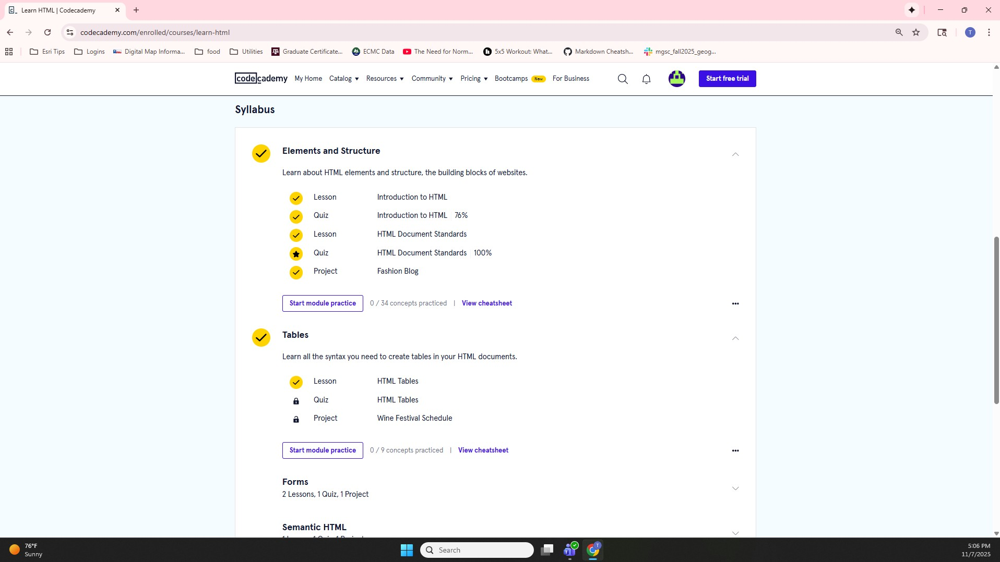
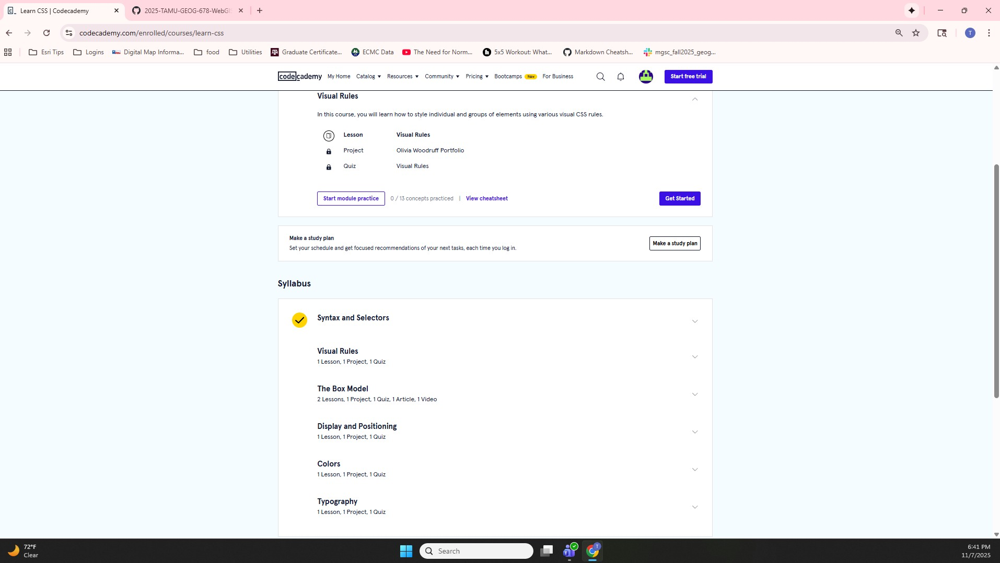
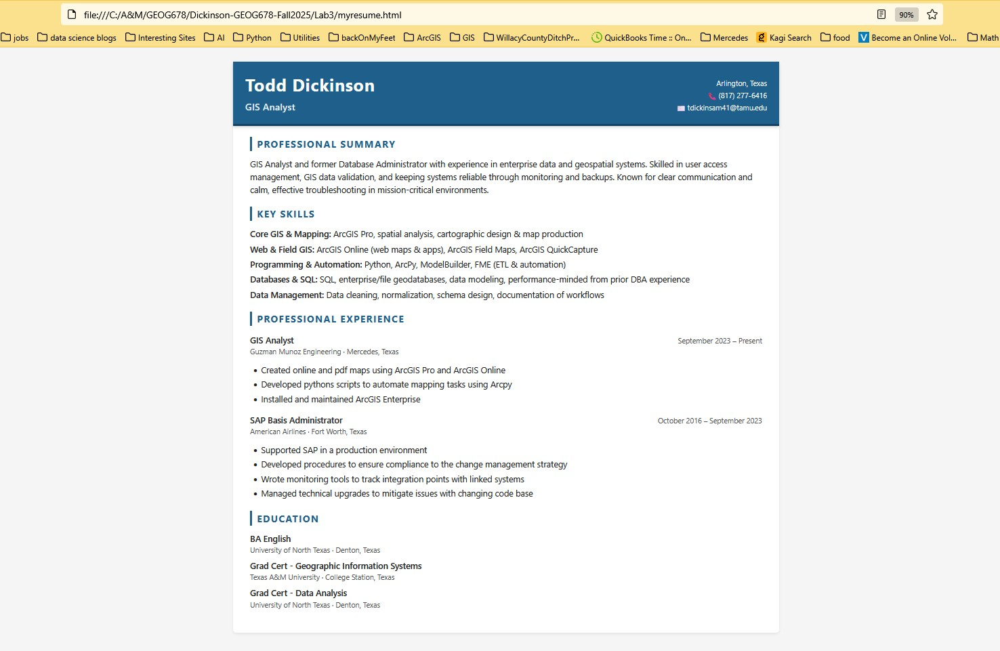

## Dickinson-GEOG678-Fall2025
### Lab 3

#### Tasks to Complete
1. Complete Codecademy online tutorial for HTML and CSS  
2. Create your own resume site

---

#### Task 1 – Codecademy HTML & CSS Tutorial

Here are the screenshots showing that the online tutorial was completed:

**Screenshot 1** – Introduction to HTML  

**Screenshot 2** – Introduction to CSS  

---

#### Task 2 – Resume Site

Build your own resume site.

**Online Resume (screenshot)**  

**Resume HTML code**  
[View resume HTML file](myresume.html)