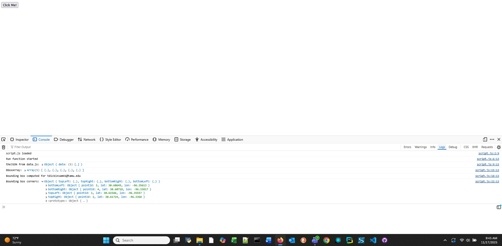

## Dickinson-GEOG678-Fall2025
### Lab 4

#### Tasks to Complete
1. Create and link the HTML and Javascript pages  
2. Create an HTML button that call javascript function
3. Create Run function inside of Javascript file
4. Create Javascript functions to calculate bounding box
5. Make Run function call other functions that find the corners of bounding box
6. Create output object from corners
7. Print out result with email
8. Take screenshot of the console showing email and bounding box

---

#### Output Screen Capture
Here is the screen capture from task 8:

