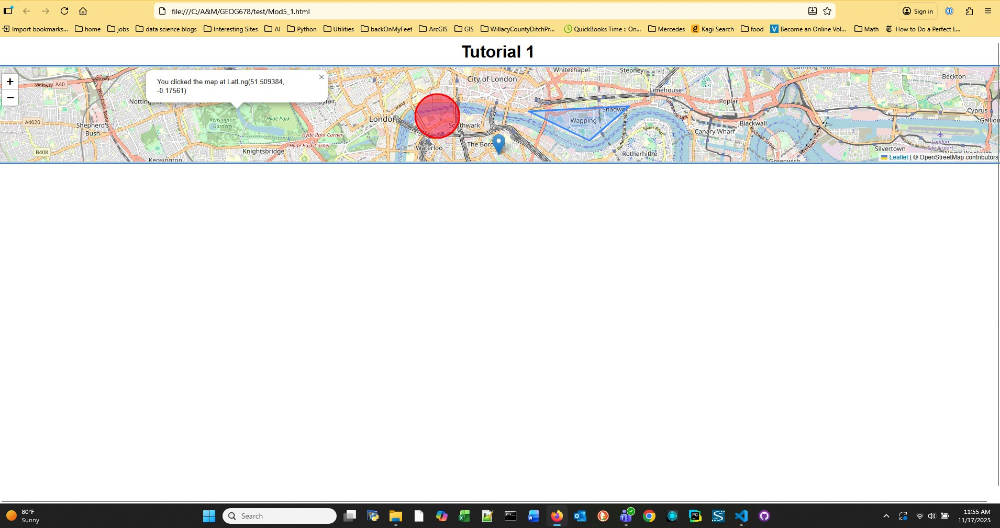
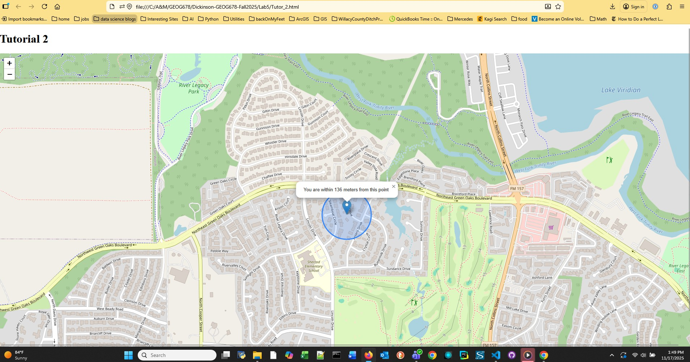
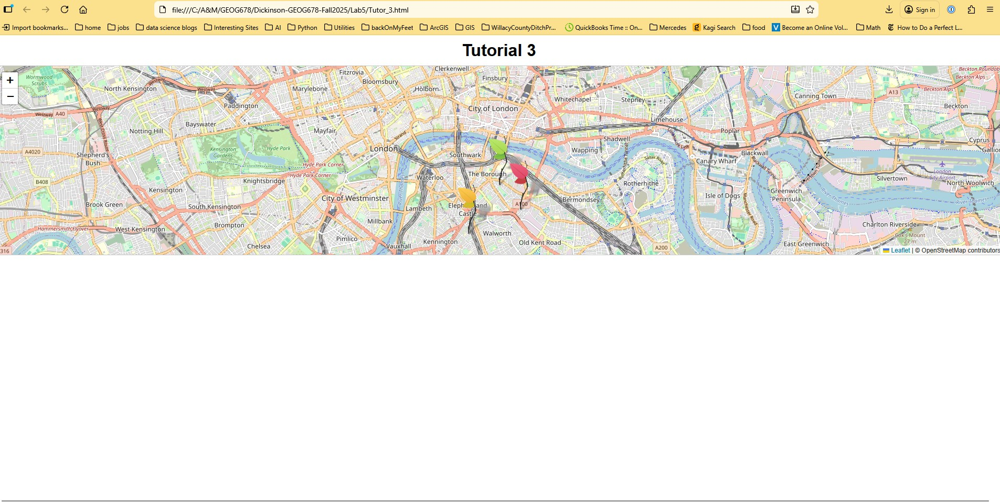
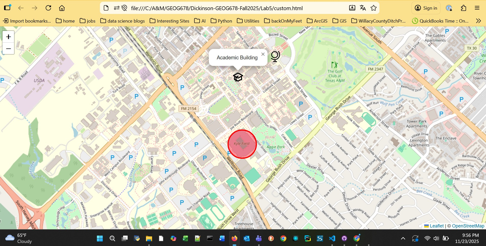
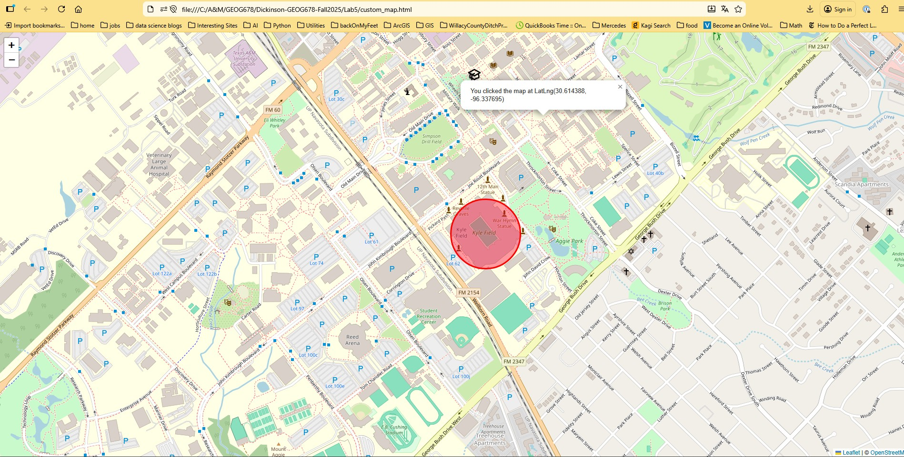

## Dickinson-GEOG678-Fall2025
### Lab 5

#### Tasks to Complete

1. Complete the three online Leaflet tutorials and post maps
2. Build a custom map 

##### Task 1
Tutorial 1 output is displayed below:

Tutorial 2 output is displayed below:

Tutorial 3 output is displayed below:

##### Task 2
Custom Map Output:

This second screenshot shows the coordinates after a mouse click:
