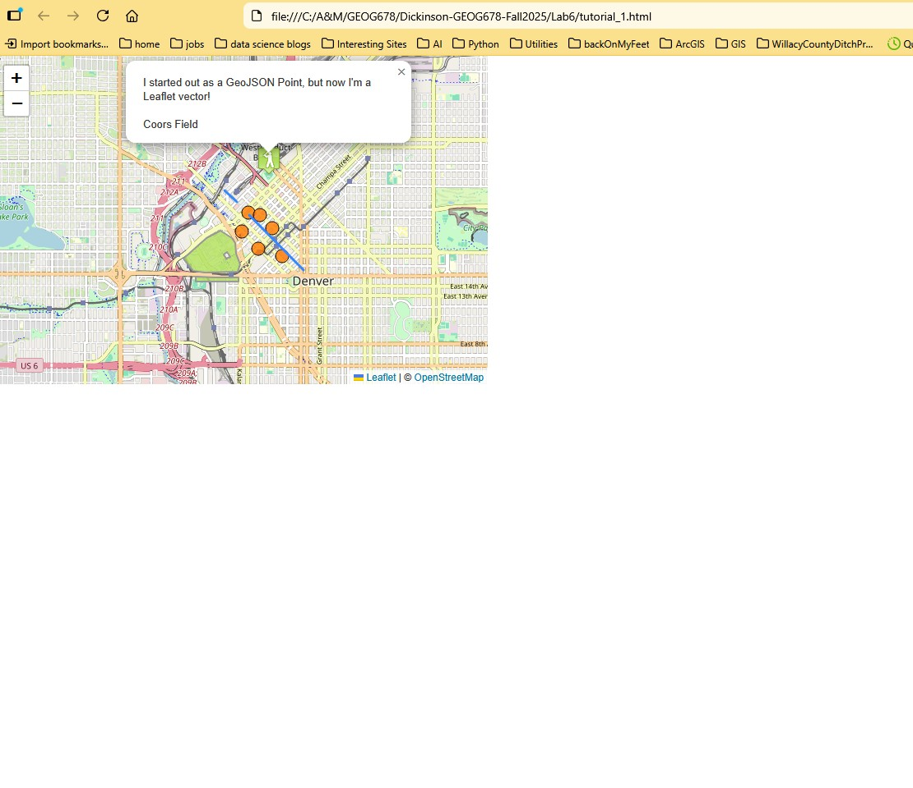
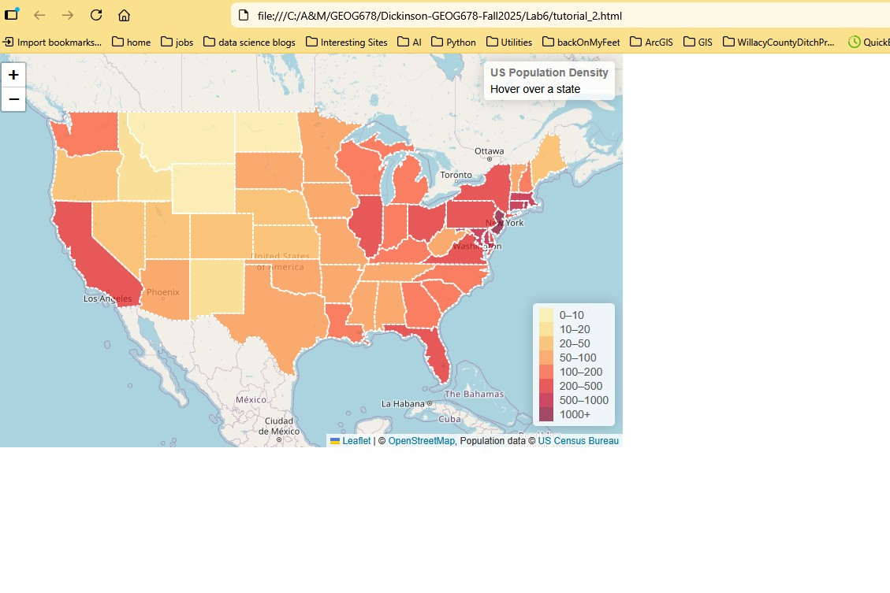
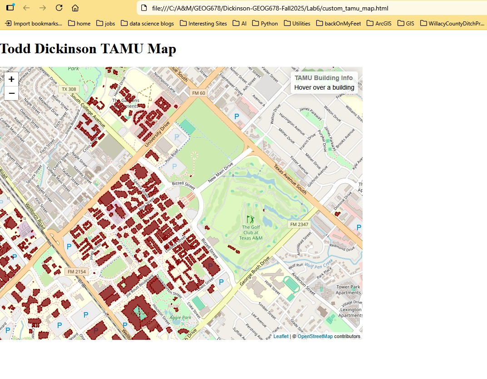
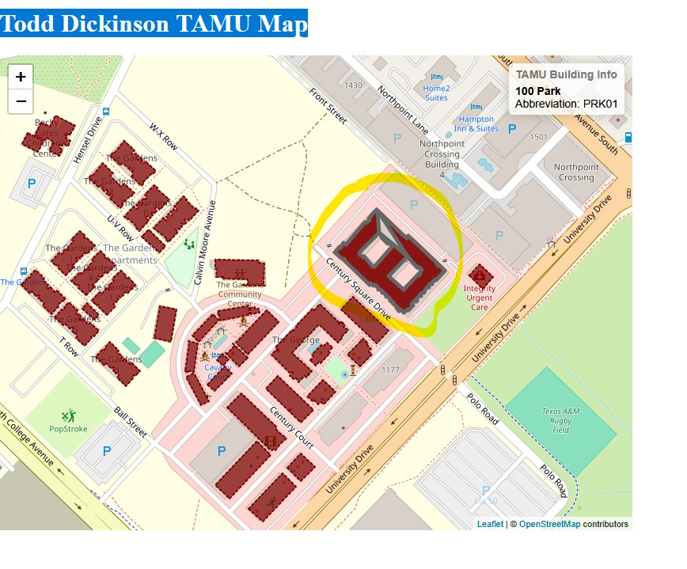
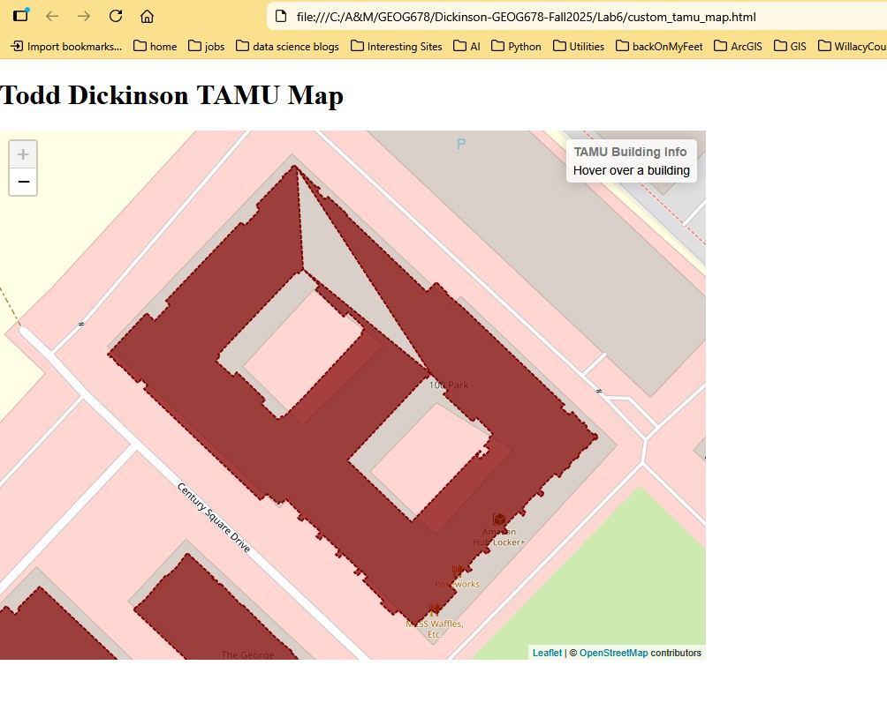

## Dickinson-GEOG678-Fall2025
### Lab 6

#### Tasks

1. Complete tutorial *Using GeoJSON with Leaflet*

2. Complete tutorial *Interactive Choropleth Map*

3. Build a custom map based on example code provided

#### Task 1 
screen capture for tutorial *Using GeoJSON with Leaflet*:

#### Task 2
screen capture for tutorial *Interactive Choropleth Map*:

#### Task 3
screen capture for custom map:

This screen capture shows two requirements from the assignment.
Note the building is highlighted and the info control shows the info on right-hand corner

This screen shows the zoom in of the building after the mouse was clicked.

