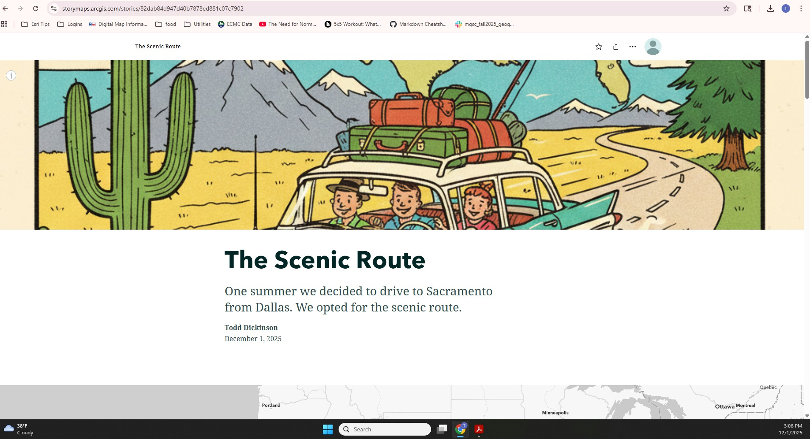
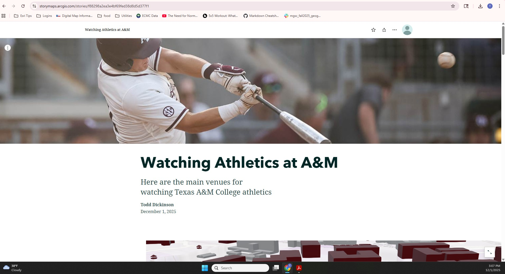

## Dickinson-GEOG678-Fall2025
### Lab 7

#### Tasks

1. Create two-dimensional storymap using Map Tour

2. Create three-dimensional storymap using Texas A&M Buildings 3D map: 

#### Task 1
Here is the link to 2D storymap in ARCGis online:
[ArcGIS 2D StoryMap](https://storymaps.arcgis.com/stories/82dab84d947d40b7878ed881c07c7902)

Here is the screenshot for the 2D storymap:

#### Task 2
Here is the link to storymap using the 3D map in ARCGis online:
[ArcGIS 3D StoryMap](https://storymaps.arcgis.com/stories/f88298a2ea3e4bf69fed38d8d5d377f1)

Here is the screenshot for the storymap that uses 3D building map:

