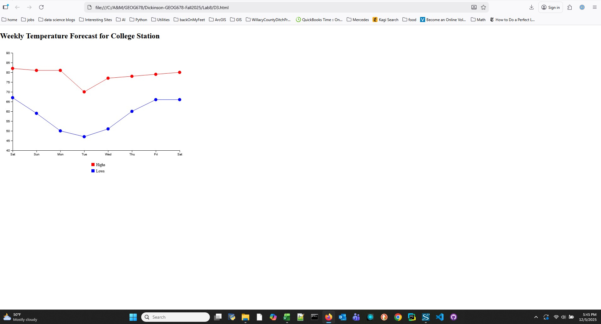
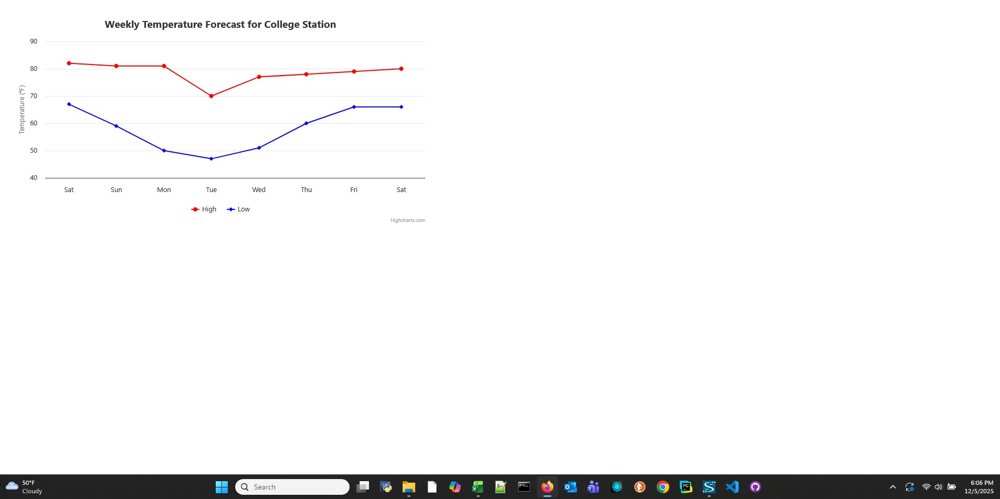
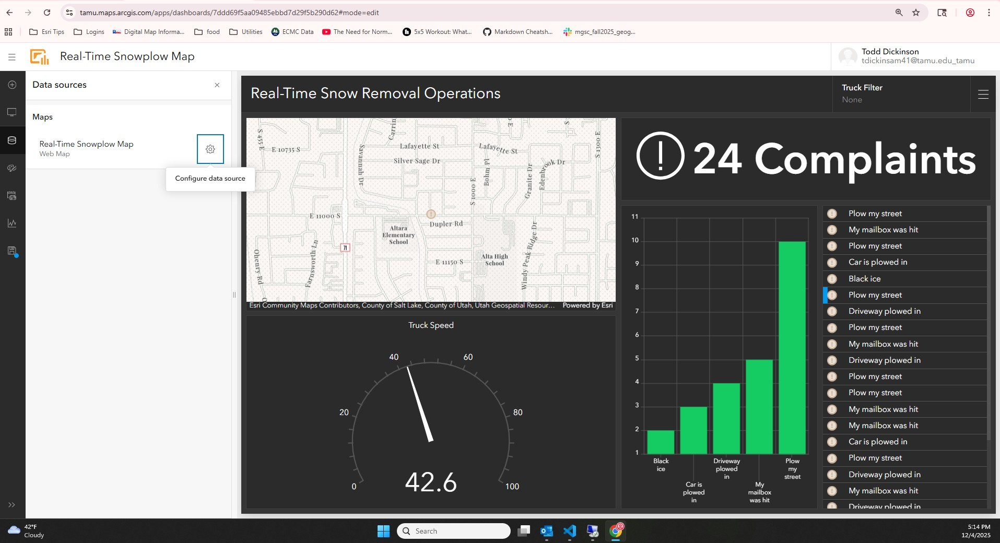

## Dickinson-GEOG678-Fall2025
### Lab 8

### Tasks

1. Create D3 Chart with Texas A&M temperature data

2. Create Highcharts Chart with the same Texas A&M temperature data

3. Complete Esri Dashboard Tutorial

#### Task 1
Here is the screenshot of the D3 Chart with the Texas A&M Temperature data:

#### Task 2
Here is the screenshot of the HighChart Chart with the Texas A&M temperature data:

#### Task 3
Here is the screenshot from the Esri Dashboard Tutorial showing snowplow data:
